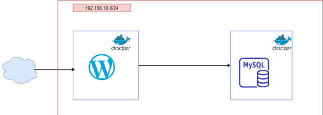

# Wordpress-Architecture-Deployment-On-Docker 

## Project Overview
This project demonstrates how to deploy a WordPress website using Docker with a MySQL database. Docker containers make the setup portable, scalable, and easy to manage. The application runs WordPress and MySQL in separate containers and connects them through Docker networking.

## Technologies Used
- Docker
- Docker Hub Images
- Linux / Ubuntu
- Web Browser

## Architecture 
     +----------------------+
     |   User / Browser     |
     +----------+-----------+
           |
           v
    +----------------------+
    | WordPress Container  |
    | (App Tier )          |
    +----------+-----------+
           |
           v
    +----------------------+
    |  MySQL Container     |
    | (DB Tier)            |
    | Wordpress            | 
    +----------------------+

## Architecture Type
### 2-Tier Architecture

- Tier 1 (Application Tier): WordPress

- Tier 2 (Database Tier): MySQL

## Prerequisites

- Docker installed

- Docker running

- Basic Docker & WordPress knowledge

## Steps to Deploy WordPress Using Docker

### 1. Launch A EC2 Instance

### 2. Install Docker
  
        sudo apt update
        sudo apt install docker -y
        sudo systemctl start docker
        sudo systemctl enable docker

Check Docker version:

        docker --version

### 3. Pull Required Docker Images

       docker pull mysql:5.7
       docker pull wordpress

### 4. Create MySQL Container
       
       docker run -d 
       --name mydb 
       -e MYSQL_ROOT_PASSWORD=root 
       -e MYSQL_DATABASE=wordpressdb 
        mysql:5.7

### 5. Create WordPress Container

       docker run -d -p 80:80 \
       --name wordpressapp \
       -e WORDPRESS_DB_HOST=mydb \
       -e WORDPRESS_DB_USER=root \
       -e WORDPRESS_DB_PASSWORD=root \
       -e WORDPRESS_DB_NAME=wordpressdb \
       --link mydb:mysql \
       wordpress
### Explanation

 - -p 80:80 → Expose WordPress on browser

- WORDPRESS_DB_HOST → MySQL container name

- --link → Connect WordPress to MySQL

### 6. Access WordPress in Browser

Open your browser and visit:

        http://<SERVER-IP>:80

#### Wordpress Login Page

#### Wordpress Dashboard

### 7. Verify Containers
       
       docker ps

### 8. Execute command inside container

      docker exec -it <CI> /bin/bash

### 9. MySQL Container
   
    docker exec -it <CI> /bin/bash
    mysql -u root -p

## Environment Variables Explanation

| Variable Name           | Description          |
| ----------------------- | -------------------- |
| `WORDPRESS_DB_HOST`     | MySQL container name |
| `WORDPRESS_DB_USER`     | Database username    |
| `WORDPRESS_DB_PASSWORD` | Database password    |
| `WORDPRESS_DB_NAME`     | Database name        |

## Advantages of Using Docker for WordPress

- Easy setup

- Platform independent

- Faster deployment

- Isolated environment

- Scalable architecture

## Conclusion

This project shows how Docker simplifies WordPress deployment by using containers. It is ideal for DevOps beginners and cloud learners who want hands-on experience with containerized applications.

This project successfully demonstrates a 2-Tier WordPress Architecture using Docker, where application and database layers are isolated, scalable, and easy to manage.

## Author

vedika kadam

Github: https://github.com/vedikakadam1100

